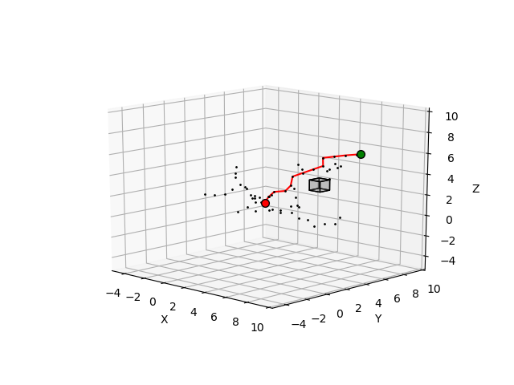
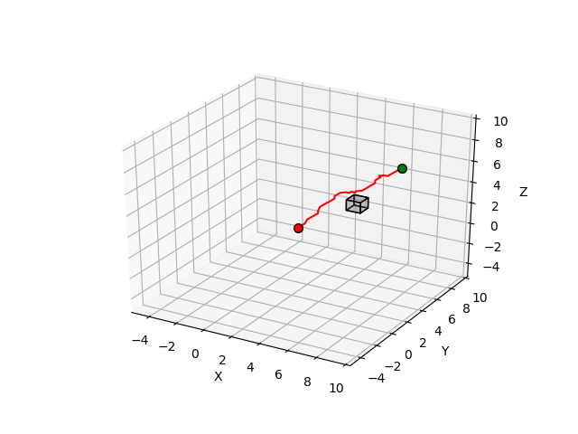

We here used RRT* and RTAA* to planning algorithms under strict timing constraints. We are provided with a set of 3-D environments in map file which are described by a rectangular outer boundary and a set of rectangular obstacle blocks. Each rectangle is described by a 9 dimensional vector, specifying its lower left corner (xmin; ymin; zmin), its upper right corner (xmax; ymax; zmax), and its RGB color.

The object of this problem is to find a feasible path from the start to goal in current configuration of environment. There are some constraints in our problem. First one is the environmental constraints, which are the blocks in our environment. And the second one is that there are constraints of the robot, which are that 1. moves a small distance at each time step, 2. no collision on the blocks in the environment, 3. the next position is produced within 2 seconds.

There are five .py files related to the solution of this problem.

RTAA.py blongs to the implement of RTAA* algorithm.

main_RTAA.py is the main file for implementation and test for RTAA* algorithm.
For some reason, we choose not to add the initialization process of our robot to time cost. 
If you want to test it, please choose which test set you want on the bottom of this file.
(please take care that maze and monza is very time costly, especially monza.)
The result include success or not, number of moves, distance of moves and total time.
There will be a 3D plot of the route finally.

RRT.py blongs to the implement of RRT* algorithm.

main_RRT.py is the main file for implementation and test for RRT* algorithm.
For some reason, we choose not to add the initialization process of our robot to time cost. 
If you want to test it, please choose which test set you want on the bottom of this file. Hope this time the maze and monza is not that annoying now.
The result include success or not, number of moves, distance of moves, total time and number of nodes in the vertices set.
There will be a 3D plot of the route and a plot of the nodes in our vetices set finally.

util.py defined some functions which are used in our implementation.

|

<figure class="half">
    
    
</figure>

 

|   |  |  |
|:---:|:---:|:---:|
| http://videoblocks.com | http://audioblocks.com | http://graphicstock.com |
